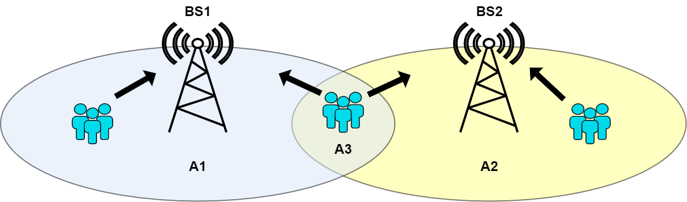
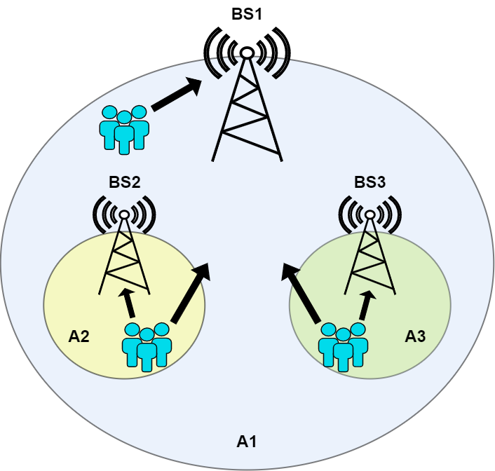
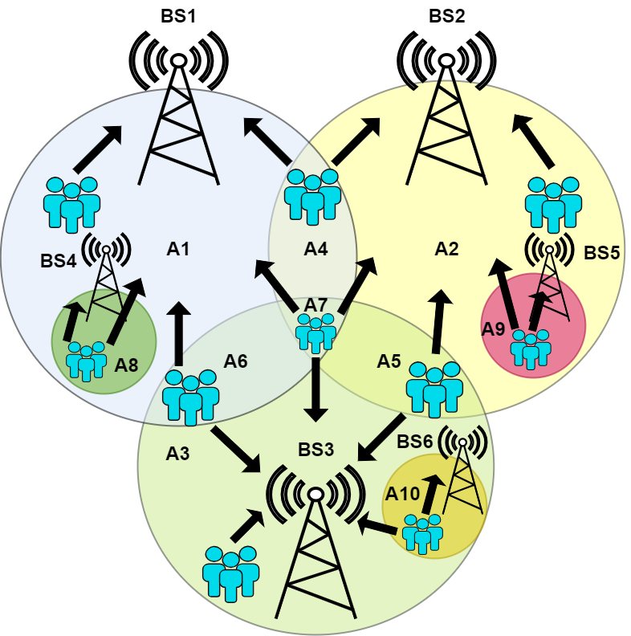

# An algorithm for dynamic functional split selection and resource allocation

This repository holds the source code of the algorithm for joint dynamic functional split selection and resource allocation developed within the [OPTIMAIX](https://optimaix.upc.edu/). 

The different variations of the algorihtm are implemented in C++ programming languaje using a common interface. The resposiroty contain the algorithm variations source cose and a simulation environment to test them. A detailed description of the algorithm has been publicly presented in the [WCNC24](https://ieeexplore.ieee.org/document/10570544). 

## Code structure

The code structure is shown below. It contains the followig folders:
- *config*: it keeps the configuration files in JSON fomrat. The fields used in the configuration files will be described below.
- *docs*: it contains drawings of the the scenarios and results.
- *include* and "src": these folder hold the C++ code which implements both the allgorithm and the evaluation environement. 
- *programs*: it just keep the main file and it is the place where the binary files are generated. 
- *scripts*: this folder contains a set of python scripts that automatize the evaluation of the scenarios and aglorithms. 


```
├── config
│   ├── aux_scen.json
│   ├── scenario1.json
│   ├── scenario2.json
│   ├── scenario3.json
│   └── scenario3_serv2.json
├── docs
│   ├── cranQueue.pdf
│   ├── escenario1.png
│   ├── escenario2.png
│   ├── escenario3.png
│   ├── optimaix1.png
│   ├── optimaix_d21_1.png
│   ├── optimaix_d21_2.png
│   └── optimaix_d21_4.png
├── include
│   ├── Algorithm1.h
│   ├── Algorithm2.h
...
│   ├── VirtualBaseStation.h
│   └── Zone.h
├── programs
│   └── main.cpp
├── README.md
├── scripts
│   └── multi_run.py
├── src
│   ├── Algorithm1.cpp
│   ├── Algorithm2.cpp
...
│   ├── VirtualBaseStation.cpp
│   ├── wscript
│   └── Zone.cpp
├── waf
└── wscript
```
## Configuration files

The configuration files keep the information that represent the scenarios shown below: 

           |           |
:---: |:---: |:---: 
<center>Canonical scenarios analyzed</center>

A reduced example of a configuration file is shown below. It contains the following main fileds:
- *FS*: number of functional splits considered in the scenario. It is used or not depending on the algorithm.
- *V*: configuration parameter used in the optimization problem to weight out the number of resources allocated and the requirements fullfilment.
- *CompLoad*: coputational capacity of the hosts where BBU is virtualized. The computational capacity of each possible functional slplit is described in [WCNC24](https://ieeexplore.ieee.org/document/10570544).
- *BS*: it is an array that contains the set of base stations deployed in the scenario. Each base station has the following parameters:
  - *id*: unique identifier of the base station in the scenario.
  - *resources*: amount of radio resources that can be allocated.
- *Zones*: this array contains the zones defined in the scenario. Each zone has the following parameters:
  - *id*: unique identifier of the zone in the scenario.
  - *BS*: array of base stations covering the zone.
  - *SignalRange*: range of signal strength received in the zone. It is computed as a independent random variable in each iteration.
  - *InterferenceRange*: range of interferences strength received in the zone. It is computed as an independent random variable in each iteration.
  - *MinThroughput* and *TargetThroughput*: minimum and target throughput desired for the service deplyed in the scenario.
  - *GlobalService*: unique name of the service deplyed in the scenario.
- *Algorithm*/*id*: unique identifier of the algorithm applied.
- *Iterations*/*Number*: number of iterations to execute.    


```JSON
{
  "FS": 4,
  "V": 5000.0,
  "CompLoad": 18,
  "BS": [
    {
      "id": "BS1",
      "resources": 100
    },
   ...
  ],
  "Zones": [
    {
      "id": "Zona01",
      "BS": ["BS1"],
      "SignalRange": [1, 81],
      "InterferenceRange": [11, 15],
      "TargetThroughput": 10,
      "MinThroughput": 1,
      "GlobalService": "ServGlobal1"
    },
    ...
  ],
  "Algorithm": [
    {
      "id": "Algoritmo4"
    }
  ],
  "Iterations": [
    {
      "Number": 10000
    }
  ]
}
``` 

## Results

For each run, two results files in plain format are created for each physical base station. The first one indicates the allocated resources to each area and the second one the selected split in each area. 
The name of the files in *\<BS ID\>_resources.txt* and *\<BS ID\>_resources.txt* where *BS ID* is the unique identifier of the physical base station defined in the configuration file. 

The content of the file is CSV using the tab as separator. Each file contains a column that indicatest the iteration of the row followed by as many columns as virtual base stations. An example is shown below:

```
Slot     BSv01     BSv02     BSv03     BSv04     BSv05     BSv06     BSv07     BSv08     BSv09     BSv10
   0         3         1         1         1         1         0         0         0         0         1
```

Besides, 4 additional results files are generated: 
- *Results_remResourcesPhysicalBs.txt*: it provides the remaining (not assigned) resources of each physical base station at each iteration.
- *Results_SINR.txt*: it gives the SINR experienced at each area in each iteration.s
- *Results_throughput.txt*: it provides the throughput experienced by each service in each iteration.
- *Results_virtualQueue.txt*: it gives the evolution of the virtual queues of each service in each iteration. Virtual queues are a mathematical artifact to perform the stochastic optimization, as described in [WCNC24](https://ieeexplore.ieee.org/document/10570544).


## How to use

The following items describe how to build and use the framework to perform a simple run and obtain results. 

### Dependencies

The implementation has a low set of dependencues, most of them being typically installed by default. To be sure that the base dependencies are installed in the system, type in a terminal: 

```console
sudo apt update
sudo apt install gcc g++ python3
``` 
Apart from those, it requires the GNU Linear Programming Kit ([GLPK](https://www.gnu.org/software/glpk/)). It is used as solver to tackle the resulting optimization problems. To install the library type in a terminalel `

```console
sudo apt-get install glpk-utils libglpk-dev
```

### Build and run

The building system used is [WAF](https://waf.io/). Assuming that the repository folder is <FOLDER>, the compilation has the following steps:

```console
cd <FOLDER>
./waf configure
```
The configuration output looks like this:
```
Setting top to                           : /home/administrator/<FOLDER>
Setting out to                           : /home/administrator/<FOLDER>/build 
Checking for 'g++' (C++ compiler)        : /usr/bin/g++ 
'configure' finished successfully (0.063s)
```

Once configured, it is build with the following command. The compilation can be done in debug or release modes. Debug mode enables internal logs and compiles with *-g* optimization flag. Relase mode disables the internal logs and compiled with *-O3* optimization flag.

```
./waf [mode=release/debug]
Waf: Entering directory `/home/administrator/<FOLDER>/build'
building
[ 1/25] Compiling src/Solver_escenario1.cpp
[ 2/25] Compiling src/BSfisica.cpp
[ 3/25] Compiling src/Algoritmo2.cpp
...
```

Once compiled the program binary is created in the folder *program/\[debug|release\]/main*. As an example, the following will execute the scenario defined in *aux_scen.json*:

```CONSOLE
./programs/debug/main config/aux_scen.json 
[Master            ] : [INFO]    ==> Lading FS...
[Master            ] : [INFO]    ==> Lading BS...
[PhyBaseStation    ] : [DEBUG]   ==> Resources of the Phy BS:  100
[PhyBaseStation    ] : [DEBUG]   ==> Resources of the Phy BS:  100
[PhyBaseStation    ] : [DEBUG]   ==> Resources of the Phy BS:  100
[PhyBaseStation    ] : [DEBUG]   ==> Resources of the Phy BS:  100
[PhyBaseStation    ] : [DEBUG]   ==> Resources of the Phy BS:  100
[PhyBaseStation    ] : [DEBUG]   ==> Resources of the Phy BS:  100
[Master            ] : [INFO]    ==> Lading Zones...
[Master            ] : [INFO]    ==> Selecting algorithm... [{"id":"Algorithm4"}]
[Master            ] : [INFO]    ==> Iterations: [{"Number":1}]
****** Iteration 0 ******NFO]    ==> 
[Zone              ] : [INFO]    ==> Demand saved:  10
...
**** ELEPASED TIME 0.0211239 sec        ****
```

The scenario consists of 6 physical base stations, so that 12 results files are generated: 6 corresponding to allocated resources and 6 to the selected functional split.

The *scripts* folder contains an example of Python script to perform several runs modifying the scenarios or parameters within them, as well as renaming of results and saving in a folder. If can be executed as follows:

```CONSOLE
python scripts/multi_run.py
```

---
This work should be referenced as:
```bibtex
@INPROCEEDINGS{10570544,
  author={Villegas, Neco and Perez, Sofia and Diez, Luis and Aguero, Ramon},
  booktitle={2024 IEEE Wireless Communications and Networking Conference (WCNC)}, 
  title={Joint and dynamic optimization of functional split selection and slice configuration in vRAN}, 
  year={2024},
  volume={},
  number={},
  pages={1-6},
  keywords={Cloud computing;Base stations;Heuristic algorithms;Computational modeling;Dynamic scheduling;Throughput;Resource management;vRAN;5G;functional split;RAN slice;optimization;Lyapunov},
  doi={10.1109/WCNC57260.2024.10570544}}
``` 

# Contact
Luis Diez;  [email](mailto:ldiez@tlmat.unican.es). [University of Cantabria](https://web.unican.es/)

Ramón Agüero; [email](mailto:ramon@tlmat.unican.es). [University of Cantabria](https://web.unican.es/)
